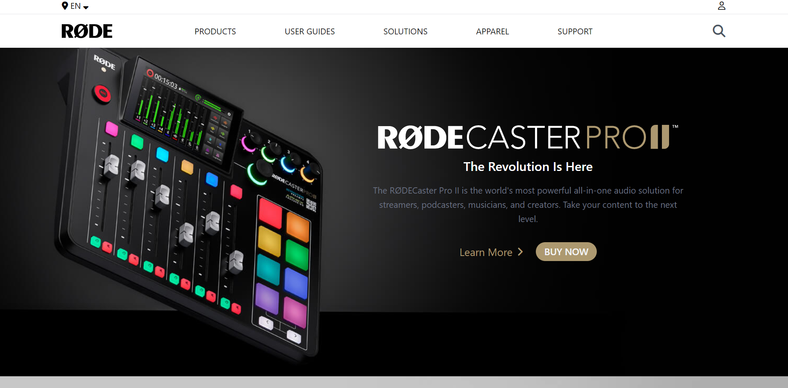

# RØDE-WEBSITE-CLONE

[live link](https://dapper-sunshine-7bdf56.netlify.app/)

## Skills Gained

-   learn using background images in tailwindcss.
-   learn using different images in different breakpoints.

##  Time taken ?

This project took me around 9 hour to finish.

## 📷 Screenshot

